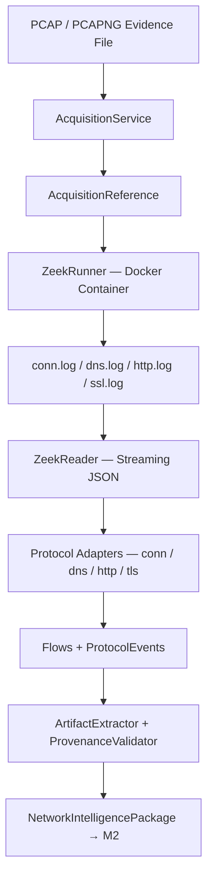

# NetSleuth-AI: M1 V1 Implementation Summary

## 1. Executive Summary

The M1 Packet Intelligence Engine is the first stage in the NetSleuth-AI pipeline. It observes network traffic ("What happened on the wire?") and normalizes it into a canonical format for downstream analysis. M1 strictly deals with observed data and does not perform threat detection, risk scoring, or any investigation logic.

M1 V1 implements the core contracts and canonical models that represent this observed data. The authoritative output of M1 is the `NetworkIntelligencePackage`, which is consumed by M2 (Analysis Engine) and eventually M3 (Correlation Engine).

## 2. M1 Responsibility

M1 is responsible for:
- Acquiring and validating PCAP/PCAPNG evidence.
- Invoking Zeek via an official Docker container to analyze the PCAP.
- Reading and normalizing Zeek's output logs (`conn.log`, `dns.log`, `http.log`, `ssl.log`).
- Creating canonical `Flow` and `ProtocolEvent` objects.
- Extracting observable `Artifact` indicators (IP, DOMAIN, URL, CERTIFICATE, etc.).
- Maintaining strict data provenance linking every field back to its Zeek source log.
- Enforcing immutable data models (frozen Pydantic models).
- Passing the final `NetworkIntelligencePackage` downstream.

M1 operates purely on structured inputs from Zeek and does not perform any external lookups, threat intelligence matching, or AI-based conclusions.

## 3. Input → Processing → Output

The complete V1 flow runs sequentially through validated acquisition, Docker-based analysis, and structured normalization stages:

## 4. Implemented Components (Phase 1)

Phase 1 focuses exclusively on the contract and canonical model definitions.

### 3.1. Contract Implementation
- **File**: `backend/app/contracts/network_intelligence.py`
- **Technology**: Pydantic v2
- **Key Models**:
  - `NetworkIntelligencePackage`: Top-level package.
  - `Flow`: Represents a network connection (from Zeek `conn.log`).
  - `ProtocolEvent`: Represents application-layer activity (DNS, HTTP, TLS).
  - `Artifact`: Extracted observable indicators.
  - `AcquisitionReference`: Record of the ingested PCAP.
  - `PacketReference`: Traceability reference to the original PCAP frame/byte offsets.
  - `Provenance`: Detailed tracking of the origin of the data.
- **Key Features**: 
  - All models are frozen (`model_config = {"frozen": True}`).
  - Protocol data models use `extra="forbid"` to ensure proper union fallback behavior.
  - Does NOT contain downstream fields like `malicious`, `risk_score`, or `severity`.

### 3.2. Fixtures
- **File**: `fixtures/network_intelligence/network-intelligence-v1-m1-phase1.json`
- Represents a complete, valid M1 output package with flows, DNS/TLS events, and extracted artifacts.

### 3.3. Tests
- **File**: `backend/tests/unit/test_network_intelligence_contract.py`
- Comprehensive test suite (78 tests) covering:
  - Valid and malformed inputs.
  - Boundary cases.
  - Contract compliance.
  - Deterministic output.
  - Provenance preservation.
  - Referential integrity between Flows, Events, and Artifacts.
  - Fixture round-trip serialization.

### 3.4. Phase 2 (Acquisition Engine Implementation)
Phase 2 establishes a trustworthy, validated identity for evidence files (`.pcap` / `.pcapng`) prior to downstream processing.

- **Files**:
  - `backend/app/engines/acquisition/__init__.py`: Package entry point.
  - `backend/app/engines/acquisition/errors.py`: Domain exception `AcquisitionError` and `AcquisitionErrorCode` enum (`FILE_NOT_FOUND`, `NOT_A_FILE`, `UNSUPPORTED_FORMAT`, `EMPTY_FILE`, `UNREADABLE_FILE`, `INVALID_CAPTURE`, `HASH_FAILURE`).
  - `backend/app/engines/acquisition/validator.py`: Path traversal guard via `Path.resolve()`, extension filtering, and 4-byte magic byte detection for PCAP/PCAPNG.
  - `backend/app/engines/acquisition/hasher.py`: Streamed SHA-256 computation in 64 KiB chunks using Python `hashlib`.
  - `backend/app/engines/acquisition/service.py`: `AcquisitionService.acquire()` orchestrating validation, hashing, and returning an immutable `AcquisitionReference`.
- **Tests**:
  - `backend/tests/unit/test_acquisition.py`: 25 unit and benchmark tests covering all error conditions, contract compliance, forensic integrity, and performance SLAs.
- **Key Features & Guarantees**:
  - **Security & Safety**: Zero subprocess/shell execution, strict path canonicalization.
  - **Forensic Integrity**: Byte-for-byte read-only operation; original evidence file remains unmodified.
  - **Performance SLAs**: SHA-256 throughput $\ge 50$ MB/s, 1 MB acquisition execution $\le 200$ ms, validation rejection $\le 5$ ms.
  - **Memory Efficiency**: Memory footprint bounded to 64 KiB regardless of file size.

### 3.5. Phase 3 (Zeek Runner Implementation)
Phase 3 implements the Docker-based runner execution environment that executes Zeek to generate logs offline.

- **Files**:
  - `backend/app/engines/packet_intelligence/zeek/__init__.py`: Package exports.
  - `backend/app/engines/packet_intelligence/zeek/errors.py`: Domain exception `ZeekRunnerError` and `ZeekRunnerErrorCode` enum.
  - `backend/app/engines/packet_intelligence/zeek/result.py`: `ZeekRunnerResult` (execution status, duration, logs found, exit codes).
  - `backend/app/engines/packet_intelligence/zeek/runner.py`: `ZeekRunner` orchestrator checking Docker, validating path context, mounting dirs read-only, and invoking `zeek -r ... LogAscii::use_json=T`.
- **Tests**:
  - `backend/tests/unit/test_zeek_runner.py`: 10 mock-based unit tests and 2 Docker-integrated E2E tests (PCAP and PCAPNG).
- **Key Features & Guarantees**:
  - **Security**: Strict path-traversal validation, only mounts validated evidence/output folders read-only, zero shell subprocess usage (`shell=False`).
  - **Integrity**: Evidence is mounted read-only (`:ro`); no edits are ever written back to evidence.
  - **Determinism**: Isolated output folder `sample_data/zeek_output/<acquisition_id>/` per run; outputs JSON logs consistently.

### 3.6. Phase 4 (Zeek Reader Implementation)
Phase 4 implements a streaming JSON log reader that consumes the output of the Zeek runner and yields raw Zeek records. It serves as a parsing boundary without canonical coercion.

- **Files**:
  - `backend/app/engines/packet_intelligence/zeek/reader.py`: `ZeekReader` implementation, `RawZeekRecord`, and `RawZeekErrorRecord` dataclasses.
  - `backend/app/engines/packet_intelligence/zeek/__init__.py`: Package exports for the reader components.
- **Tests**:
  - `backend/tests/unit/test_zeek_reader.py`: 10 mock-based unit tests testing boundaries, memory efficiency, and malformed inputs, plus 1 E2E integration test reading real logs.
- **Key Features & Guarantees**:
  - **Memory Efficiency**: Incremental reading using generators; avoids loading multi-gigabyte logs into RAM.
  - **Deterministic Error Handling**: Malformed lines yield `RawZeekErrorRecord` objects cleanly without silently discarding data or crashing the stream.
  - **Zero Canonical Coercion**: Output fields retain original Zeek types and names, preserving full source data fidelity for downstream adapters.

### 3.7. Phase 5 (conn.log to Flow Adapter)
Phase 5 implements the conversion of raw Zeek `conn.log` records into canonical M1 `Flow` objects without performing any downstream threat logic or artifacts extraction.

- **Files**:
  - `backend/app/engines/packet_intelligence/adapters/conn.py`: `ConnAdapter` implementation.
  - `backend/app/engines/packet_intelligence/adapters/errors.py`: Adapter domain errors (`AdapterError`, `AdapterErrorCode`).
- **Tests**:
  - `backend/tests/unit/test_conn_adapter.py`: 10 unit tests covering edge cases and deterministic errors, plus 1 integration test for JSON -> Flow mapping.
- **Key Features & Guarantees**:
  - **Deterministic Error Boundary**: Returns `AdapterError` on malformed logs rather than throwing exceptions to support streaming workflows.
  - **Strict "Observe Only" Mapping**: Maps types robustly but explicitly avoids deriving assumptions (e.g. `end_time` remains absent if unobserved directly as such).

### 3.8. Phase 6 (dns.log to DNS ProtocolEvent Adapter)
Phase 6 implements the conversion of raw Zeek `dns.log` records into canonical M1 `ProtocolEvent` objects containing `DNSData`, mapping them to their parent Flow using an injected dictionary mapping (`flow_index`).

- **Files**:
  - `backend/app/engines/packet_intelligence/adapters/dns.py`: `DNSAdapter` implementation.
- **Tests**:
  - `backend/tests/unit/test_dns_adapter.py`: 12 unit tests and 1 E2E integration test.
- **Key Features & Guarantees**:
  - **Stateless Correlation**: Joins `zeek_uid` to `flow_id` strictly via an injected `flow_index` dictionary, avoiding the generation of synthetic flow records on missing joins.

### 3.9. Phase 7 (http.log to HTTP ProtocolEvent Adapter)
Phase 7 implements the conversion of raw Zeek `http.log` records into canonical M1 `ProtocolEvent` objects containing `HTTPData`, strictly focused on observable unencrypted metadata.

- **Files**:
  - `backend/app/engines/packet_intelligence/adapters/http.py`: `HTTPAdapter` implementation.
- **Tests**:
  - `backend/tests/unit/test_http_adapter.py`: 14 unit tests and 1 E2E integration test.
- **Key Features & Guarantees**:
  - **Safe Type Parsing**: Handles Zeek absence markers (`"-"`) correctly mapping them to Python `None` and safely performing type assertions for numeric fields.
  - **No Artifact/URL Synthesis**: Focuses strictly on observable fields (host, method, uri, user_agent), abstaining from URL reconstruction or artifact generation.

### 3.10. Phase 8 (ssl.log to TLS ProtocolEvent Adapter)
Phase 8 implements the conversion of raw Zeek `ssl.log` records into canonical M1 `ProtocolEvent` objects containing `TLSData`, maintaining a strict metadata boundary for encrypted traffic.

- **Files**:
  - `backend/app/engines/packet_intelligence/adapters/tls.py`: `TLSAdapter` implementation.
- **Tests**:
  - `backend/tests/unit/test_tls_adapter.py`: 11 unit tests and 1 E2E integration test checking the boundary constraints.
- **Key Features & Guarantees**:
  - **Strict Encryption Boundary**: Preserves SNI, version, cipher, and certificate details but strictly refuses to infer or synthesize HTTP-level details (Method, URI, Body) from encrypted streams.

### 3.11. Phase 9 (Artifact Extraction & Provenance)
Phase 9 implements the dynamic extraction of canonical `Artifact` models (DOMAIN, IP, USER_AGENT) from normalized `ProtocolEvent` objects, strictly maintaining provenance linking generated artifacts back to their origin events.

- **Files**:
  - `backend/app/engines/packet_intelligence/artifacts/extractor.py`: `ArtifactExtractor` implementation.
  - `backend/app/engines/packet_intelligence/provenance/validator.py`: `ProvenanceValidator` implementation.
- **Tests**:
  - `backend/tests/unit/test_artifact_extractor.py`: 8 unit tests.
  - `backend/tests/unit/test_provenance_validator.py`: 5 unit tests.
- **Key Features & Guarantees**:
  - **Immutable Provenance**: Every extracted artifact receives a generated UUIDv4 and retains its source event ID, flow ID, and acquisition context.
  - **No Inferences**: Abstained from synthesizing URLs, file paths, or certificate identities unless they are directly observed and uniquely identifiable in the protocol data.

### 3.12. Phase 10 (NetworkIntelligencePackage Assembly)
Phase 10 implements the final orchestration layer that wires all M1 components together to produce the `NetworkIntelligencePackage`.

- **Files**:
  - `backend/app/engines/packet_intelligence/orchestrator.py`: `M1Orchestrator` implementation.
  - `backend/app/engines/packet_intelligence/errors.py`: Package assembly error models.
- **Tests**:
  - `backend/tests/unit/test_orchestrator.py`: 4 unit/E2E integration tests.
- **Key Features & Guarantees**:
  - **Referential Integrity Validation**: Enforces that all artifacts and events correctly reference known flow IDs and event IDs before assembly.
  - **Downstream Boundary**: Ensures the assembled package contains only raw observations without leaking any downstream analytic fields (e.g. risk score, severity, MITRE tags).

## 5. Total Test Suite Status

- **Contract Tests (Phase 1)**: 78 tests passing
- **Acquisition Engine Tests (Phase 2)**: 25 tests passing
- **Zeek Runner Tests (Phase 3)**: 12 tests passing
- **Zeek Reader Tests (Phase 4)**: 11 tests passing
- **Flow Adapter Tests (Phase 5)**: 11 tests passing
- **DNS Adapter Tests (Phase 6)**: 13 tests passing
- **HTTP Adapter Tests (Phase 7)**: 15 tests passing
- **TLS Adapter Tests (Phase 8)**: 12 tests passing
- **Artifact Extractor & Provenance Tests (Phase 9)**: 13 tests passing
- **Orchestrator Tests (Phase 10)**: 4 tests passing
- **Total M1 Unit Tests**: 192 tests passing

## 6. M1 → M2 Handoff

The integration boundary between M1 and M2 is strictly documented and serialized via JSON schema.

- **M1 produces:** `NetworkIntelligencePackage` V1
- **M2 consumes:** `NetworkIntelligencePackage` V1

**Authoritative contract:**
`backend/app/contracts/network_intelligence.py`

**Reference fixture:**
`fixtures/network_intelligence/network-intelligence-v1-m1-phase1.json`

M2 should build directly against the Pydantic contract models and should **not** import M1 internal engine classes (adapters, runner, reader).

## 7. Security / Forensic Design

**IMPLEMENTED:**
- Strict path-traversal prevention via `Path.resolve()` canonicalization.
- 4-byte magic byte validation prevents processing of non-PCAP files.
- Evidence mounted read-only (`:ro`) inside Docker; original capture file is never modified.
- Zero shell subprocess usage (`shell=False`) throughout all engine layers.
- Frozen Pydantic models (`model_config = {"frozen": True}`) enforce immutability of all M1 outputs.
- `extra="forbid"` on protocol data union models prevents undeclared field injection.
- Provenance tracing links every artifact and event back to its source log, flow ID, and acquisition reference.
- Deterministic IDs support 100% test reproducibility.

**NOT IMPLEMENTED (Future):**
- Real-time tamper-evident hashing of log outputs.
- Encrypted evidence vaults.
- External SIEM or cloud storage integration.
- IAM / RBAC tracking per acquisition job.

## 8. Current Limitations

- **Batch-Only:** M1 processes a single static PCAP per invocation; real-time live capture is not supported.
- **Docker Dependency:** Zeek execution requires a running Docker daemon and the `zeek/zeek:lts` image to be locally cached.
- **In-Process Only:** No database persistence layer; all intermediate state is in-memory and discarded after the `NetworkIntelligencePackage` is assembled.
- **No Threat Logic:** M1 strictly observes; it performs zero risk scoring, severity classification, or MITRE ATT&CK tagging.

## 9. Not Implemented in M1 V1

- Threat detection, risk scoring, or severity classification.
- ML-based anomaly detection or probabilistic heuristics.
- External Threat Intelligence (OSINT / VirusTotal) enrichment.
- Real-time live capture or streaming PCAP ingestion.
- Report generation (explicitly deferred to M4 via M3).
- Payload/content inspection beyond observable metadata.

## 10. File / Component Inventory

| Component | Location | Purpose | Status |
|-----------|----------|---------|--------|
| Network Intelligence Contract | `backend/app/contracts/network_intelligence.py` | M1 Output Schema + M2 Input Contract | COMPLETE |
| Acquisition Errors | `backend/app/engines/acquisition/errors.py` | Domain exception hierarchy | COMPLETE |
| Acquisition Validator | `backend/app/engines/acquisition/validator.py` | Path guard + magic byte detection | COMPLETE |
| Acquisition Hasher | `backend/app/engines/acquisition/hasher.py` | Streamed SHA-256 computation | COMPLETE |
| Acquisition Service | `backend/app/engines/acquisition/service.py` | Orchestrates validate → hash → reference | COMPLETE |
| Zeek Runner | `backend/app/engines/packet_intelligence/zeek/runner.py` | Docker-based offline Zeek execution | COMPLETE |
| Zeek Reader | `backend/app/engines/packet_intelligence/zeek/reader.py` | Streaming JSON log parser | COMPLETE |
| conn.log Adapter | `backend/app/engines/packet_intelligence/adapters/conn.py` | Maps conn.log → Flow | COMPLETE |
| dns.log Adapter | `backend/app/engines/packet_intelligence/adapters/dns.py` | Maps dns.log → DNSProtocolEvent | COMPLETE |
| http.log Adapter | `backend/app/engines/packet_intelligence/adapters/http.py` | Maps http.log → HTTPProtocolEvent | COMPLETE |
| ssl.log Adapter | `backend/app/engines/packet_intelligence/adapters/tls.py` | Maps ssl.log → TLSProtocolEvent | COMPLETE |
| Artifact Extractor | `backend/app/engines/packet_intelligence/artifacts/extractor.py` | Extracts DOMAIN / IP / USER_AGENT artifacts | COMPLETE |
| Provenance Validator | `backend/app/engines/packet_intelligence/provenance/validator.py` | Enforces referential integrity | COMPLETE |
| M1 Orchestrator | `backend/app/engines/packet_intelligence/orchestrator.py` | Wires all components → NetworkIntelligencePackage | COMPLETE |
| Reference Fixture | `fixtures/network_intelligence/network-intelligence-v1-m1-phase1.json` | M1→M2 reference payload | COMPLETE |

## 11. Git / Delivery Status

- **Branch:** `feature/m1-packet-intelligence`
- **Working Tree:** Clean. All phases delivered.

## 12. Final V1 Status

| Area | Status |
|------|--------|
| Contract & Domain Models | COMPLETE |
| Acquisition Engine | COMPLETE |
| Zeek Runner (Docker) | COMPLETE |
| Zeek Reader (Streaming) | COMPLETE |
| conn.log Adapter | COMPLETE |
| dns.log Adapter | COMPLETE |
| http.log Adapter | COMPLETE |
| ssl.log Adapter | COMPLETE |
| Artifact Extractor | COMPLETE |
| Provenance Validator | COMPLETE |
| M1 Orchestrator | COMPLETE |
| Reference Fixture | COMPLETE |
| Tests (192 total) | PASS |
| M2 handoff contract | READY |
