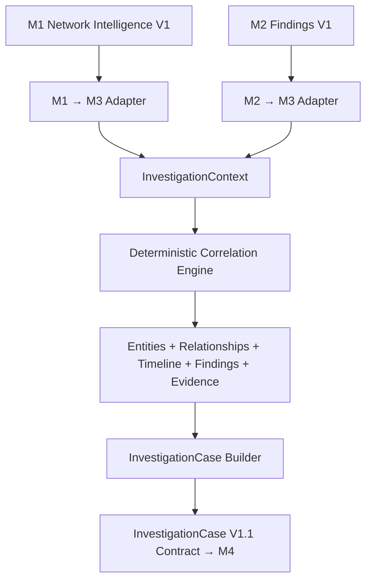

# NetSleuth-AI: M3 V1 Implementation Summary

## 1. Executive Summary

The M3 Correlation + Investigation Engine represents the intelligence synthesis layer of NetSleuth-AI. Where M1 observes ("What happened?") and M2 detects ("What is suspicious?"), M3 investigates ("How do these observations and findings relate?"). 

M3 V1 strictly implements deterministic, rule-based correlation to merge discrete network events, structural findings, and entity references into a unified timeline and forensic graph. The final output of M3 is the assembled `InvestigationCase`, which acts as the authoritative intelligence package handed off to the M4 Reporting Engine.

## 2. M3 Responsibility

M3 is responsible for:
- Constructing an isolated, in-memory `InvestigationContext`.
- Normalizing and merging entities and establishing strict identity domains.
- Safely handling timestamp bounds and timeline ordering.
- Reconstructing deterministic relationships (edges) between entities.
- Assembling the final `InvestigationCase` V1.1 output document.

M3 operates purely on structured inputs from M1 (Network Intelligence) and M2 (Findings) and does not perform real-time collection or external lookups.

## 3. Input → Processing → Output

The complete V1 flow runs systematically across explicit, tested boundary adapters:



## 4. M3 Domain Model

The M3 internal domain is defined in `src/m3_correlation/domain/investigation.py` and implements:
- **`InvestigationContext`**: The central state container during a correlation run. Holds lists of entities, timeline events, evidence, findings, and relationships. It handles temporal merging logic via `add_entity()`.
- **`Entity`**: Represents an active node in the graph (e.g., host, IP, flow). Contains timezone-aware temporal bounds (`first_seen`, `last_seen`).
- **`TimelineEvent`**: A chronologically sorted event with a mandatory UTC timezone-aware Python `datetime`. Supports multiple `entity_ids` to show involvement.
- **`Relationship`**: A deterministic graph edge representing correlation (e.g., `queried`, `resolved_to`). Enforces a strict 0.0 to 1.0 `confidence` boundary.
- **`FindingReference`**: The canonical pointer to an upstream M2 finding, storing `finding_id` and `role`. M3 avoids duplicating M2 finding payloads natively.
- **`EvidenceReference`**: A direct trace to M1 observations, explicitly categorized by `evidence_type` (e.g., `flow`, `dns`).

## 5. Entity Identity

M3 V1 enforces a deterministic `namespace:value` identity convention. This eliminates collisions and safely differentiates structurally similar data.

Examples:
- `ip:203.0.113.10`
- `domain:suspicious.example`
- `flow:FLOW-001`
- `protocol_event:EVENT-001`

UUIDs and random hashes are strictly prohibited in V1 to maintain 100% test reproducibility and deterministic artifact generation.

## 6. M1 → M3 Adapter

**Input:** `NetworkIntelligencePackage` (M1 V1 schema)
**Output:** M3 `InvestigationContext`

The M1 adapter is a translation boundary that:
- Validates the incoming M1 payload against the JSON contract.
- Normalizes ISO-8601 timestamps into Python UTC-aware `datetime` objects.
- Maps IPs, Domains, and Hosts to namespaced M3 Entities.
- Maps explicitly labeled `dns` events to `protocol_event` entities and timeline nodes.
- Preserves upstream IDs via `EvidenceReference`.

**Constraints:** It performs no active correlation or maliciousness inference.

## 7. M2 → M3 Adapter

**Input:** `Finding` (M2 V1 schema)
**Output:** M3 `InvestigationContext` updates

The M2 adapter focuses entirely on updating the context with detected alerts:
- Validates the M2 finding payload structure.
- Registers canonical `FindingReference` entries.
- Maps `FindingReference` natively to a temporary graph anchor `finding:ID`.
- Captures explicit evidentiary relationships natively asserted by M2.

**Constraints:** The adapter translates detected finding metadata but does not perform subsequent threat hunting or secondary correlation.

## 8. Deterministic Correlation Engine

The `CorrelationEngine` applies explicit heuristics across the populated `InvestigationContext`. Relationships are created **only** when supported by available evidence. 

| Rule | Source Type | Relationship | Target Type | Basis |
|------|-------------|--------------|-------------|-------|
| Flow Mapping | `flow` | `observed_in` | `protocol_event` | M1 `flow_id` back-references. |
| DNS Resolution | `domain` | `resolved_to` | `ip` | Explicit DNS answer values mapping to IPs. |
| DNS Query | `protocol_event` | `queried` | `domain` | Explicit DNS queries mapping to Domains. |
| Artifact Provenance | `artifact` | `derived_from` | `flow` / `session` | Explicit extraction tracking. |
| Generic Association | Entity | `associated_with` | Entity | Temporal overlap heuristic fallback. |
| Finding Support | `finding` | `supported_by` | Evidence / Entity | M2 evidence references. |

Negative checks prevent invalid IP extraction from DNS, and duplicates are aggressively blocked.

## 9. Timeline

M3 guarantees a chronologically precise sequence of events.
- **Timezone Safety**: Timezones are strictly enforced. Naive datetime objects are categorically rejected.
- **Ordering**: The context relies on sorted lists of timezone-aware UTC timestamps.
- **Multiple Entities**: Timeline events structurally support multiple `entity_ids` arrays to map full involvement.

*Note:* Temporal ordering in M3 implies sequence, not necessarily causal or malicious attack chains.

## 10. Investigation Case Builder

**Input:** M3 `InvestigationContext`
**Output:** `InvestigationCase` V1.1 JSON

The `InvestigationCaseBuilder` transforms the in-memory graph into a validable JSON document. It safely constructs:
- Deterministic IDs (e.g. `CASE-ACQ-001` fallback).
- Global temporal bounds (`created_at`, `updated_at`).
- Complete serializations of entities, relationships, timeline events, evidence, and finding references.

It operates strictly as an assembler and executes no supplemental correlation logic.

## 11. InvestigationCase V1.1

During M3 implementation, three critical structural gaps were identified in the original M3→M4 contract that caused forensic data loss. The schema was structurally upgraded to **V1.1** to natively preserve:

1. **Relationships:** A new `relationships` array natively maps deterministic edges (`source`, `target`, `type`, `confidence`).
2. **`protocol_event` Entity Type:** Added to the enum to prevent inaccurate fallback categorization (e.g. `artifact`).
3. **Array Entity References:** `TimelineEvent` now natively holds `entity_ids` arrays to capture unbounded graph node participation.

*Note:* `FindingReference` intentionally remains minimal in V1.1. M4 is expected to join this against the upstream M2 finding payload if rich metadata is required.

## 12. M3 → M4 Handoff

The integration boundary between M3 and M4 is strictly documented and serialized via JSON schema.

- **M3 produces:** `InvestigationCase` V1.1
- **M4 consumes:** `InvestigationCase` V1.1

**Authoritative contract:**
`docs/contracts/investigation-case-v1.1.json`

**Reference fixture:**
`fixtures/investigations/investigation-case-v1-scenario-001-expected.json`

M4 should build directly against this contract and should **not** import M3 internal python classes or adapters.

## 13. Security / Forensic Design

**IMPLEMENTED:**
- Strict `jsonschema` validation preventing unauthorized structural properties (`additionalProperties: false`).
- Enumeration whitelisting for all types, severities, and roles.
- Mandatory timezone-aware Python UTC `datetime` objects.
- Deterministic IDs supporting 100% test reproducibility.
- Provenance preservation tracing all claims back to an explicit `EvidenceReference`.

**NOT IMPLEMENTED (Future):**
- Real-time tamper-evident hashing.
- Encrypted evidence vaults.
- External cloud SIEM integration.
- IAM / RBAC tracking for human investigators.

## 14. Testing

M3 has a comprehensive integration and unit testing suite.
The suite validates schemas, adapters, context state merging, temporal boundaries, negative edge cases, and end-to-end integration boundaries.

- **Total Tests:** 40
- **Status:** 40/40 PASSING

```text
Ran 40 tests in 0.377s
OK
```

## 15. Scenario 001

A deterministic "Synthetic Beaconing" scenario proves the full execution pipeline:
1. **M1 Fixture:** Supplies an SSL connection (`FLOW-001`) and a DNS query (`EVENT-001` to `suspicious.example`).
2. **M2 Fixture:** Supplies a Finding (`FINDING-001`) implicating the M1 flow.
3. **Correlation Engine:** Natively recognizes the finding is `supported_by` the flow, that the DNS event `queried` the domain, and temporally merges entities.
4. **InvestigationCase V1.1:** Successfully generated and validated against the updated schema, capturing all relationships and timeline entity distributions accurately.

## 16. Current Limitations

- **Deterministic Only:** The correlation graph strictly executes hardcoded procedural logic.
- **In-Memory Volatility:** M3 is entirely stateless and does not use a database graph persistence layer (e.g. Neo4J, Redis).
- **No Attack Chain Inference:** M3 builds the forensic timeline but does not infer Mitre ATT&CK stage progression natively.

## 17. Not Implemented in M3 V1

- ML-based correlation or probabilistic threat hunting.
- Automated API integrations or external Threat Intelligence (OSINT/VT) enrichment.
- Real-time SIEM (Kafka) streaming adapters.
- Report Generation (This is explicitly deferred to M4).

## 18. File / Component Inventory

| Component | Location | Purpose | Status |
|-----------|----------|---------|--------|
| Investigation Case Schema | `docs/contracts/investigation-case-v1.1.json` | M3→M4 Boundary Contract | V1.1 COMPLETE |
| M3 Domain Models | `src/m3_correlation/domain/investigation.py` | Context & State Management | COMPLETE |
| M1 Adapter | `src/m3_correlation/adapters/m1_adapter.py` | M1 Input Translation | COMPLETE |
| M2 Adapter | `src/m3_correlation/adapters/m2_adapter.py` | M2 Input Translation | COMPLETE |
| Correlation Engine | `src/m3_correlation/correlation/correlation_engine.py` | Graph Edge Generation | COMPLETE |
| Case Builder | `src/m3_correlation/investigation/case_builder.py` | V1.1 JSON Assembly | COMPLETE |
| Contract Validator | `src/shared/contract_validation.py` | Schema strictness enforcement | COMPLETE |

## 19. Git / Delivery Status

- **Branch:** `feature/m3-correlation`
- **Latest Commit:** `5c0625b chore(m3): finalize investigation case v1.1 contract`
- **Working Tree:** Clean. Synchronized with `origin`.

## 20. Final V1 Status

| Area | Status |
|------|--------|
| M3 domain | COMPLETE |
| M1 adapter | COMPLETE |
| M2 adapter | COMPLETE |
| Correlation engine | COMPLETE |
| Timeline | COMPLETE |
| InvestigationCase builder | COMPLETE |
| V1.1 contract | COMPLETE |
| Schema validation | COMPLETE |
| Tests | PASS |
| M4 handoff contract | READY |
