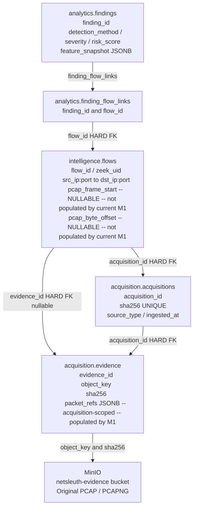

# DB-5: Logical / ER Model

This document is the **canonical logical model** for the NetSleuth-AI database. It translates DB-3 entity decisions, DB-4 relationship and cardinality decisions, and DB-4-GAP-AMENDMENTS into a complete, implementation-ready ER model. No SQL is written here. DB-6 translates this directly into DDL.

**Gate:** An engineer reading this document alone can implement the full PostgreSQL schema without inventing anything.

---

## 1. Schema Groups

| Schema | Tables Owned |
|:---|:---|
| `acquisition` | `acquisitions`, `evidence`, `case_acquisition_links` |
| `intelligence` | `flows`, `protocol_events`, `artifacts` |
| `analytics` | `findings`, `findings_packages`, `model_registry`, `case_finding_links`, `finding_flow_links`, `finding_event_links`, `finding_artifact_links` |
| `investigation` | `investigation_cases`, `entities`, `relationships`, `behaviors`, `timeline_events`, `mitre_mappings`, `attack_chains`, `relationship_finding_links`, `entity_artifact_links`, `behavior_finding_links`, `mitre_finding_links` |
| `custody` | `evidence_items`, `custody_events`, `reports` |
| `audit` | `audit_events` |
| `identity` | `users`, `case_access` |

**Identity isolation rule:** `identity` must not be a hard FK dependency in any forensic schema. Permitted cross-references only: soft `actor_id` on `audit.audit_events`; hard FK from `identity.case_access.case_id` to `investigation.investigation_cases`.

---

## 2. M1 Validation Note — Packet References

> **Validation required before DB-9 (M1 Persistence).**

After reviewing `network-intelligence-v1.json` and `network-intelligence-v1-m1-phase1.json`:

| Field | DB-4 Assumption | M1 Reality |
|:---|:---|:---|
| Scope | Per-flow columns on `flows` | Per-acquisition block on package root `packet_references[]` |
| `byte_offset` | Populated | Currently `null` in fixture |
| `flow_id` linkage | Via FK | **Not present** in `packet_references` schema |

**Resolution:** Per-flow PCAP columns retained on `flows` as nullable (no runtime guarantee of population). Acquisition-level block persisted as `packet_refs JSONB` on `evidence`. The full traceability chain `Finding → finding_flow_links → Flow → evidence_id → Evidence → sha256 + MinIO` remains intact.

---

## 3. Entity Catalog

**Type notation:** `TEXT` · `BIGINT` · `INTEGER` · `FLOAT` · `BOOLEAN` · `TIMESTAMPTZ` · `JSONB` · `TEXT[]`

---

### Schema: `acquisition`

#### `Acquisition` — Table: `acquisition.acquisitions`

| Column | Type | Nullable | Default | Notes |
|:---|:---|:---|:---|:---|
| `acquisition_id` | TEXT | NO | — | **PK** |
| `file_name` | TEXT | NO | — | Original PCAP filename |
| `file_size` | BIGINT | YES | — | Null until sealed for live captures |
| `sha256` | TEXT | NO | — | SHA-256 hex digest. **UNIQUE** |
| `format` | TEXT | NO | — | `pcap` or `pcapng` |
| `source_type` | TEXT | NO | — | `pcap`, `pcapng`, `live_interface`, `tap`, `span`, `cloud_mirror`, `virtual_interface` |
| `capture_interface` | TEXT | YES | — | Interface for live/tap captures (e.g. `eth0`) |
| `capture_filter` | TEXT | YES | — | BPF filter string. Audit trail |
| `source_environment` | TEXT | YES | — | Free-text environment description |
| `capture_started_at` | TIMESTAMPTZ | YES | — | Capture session start |
| `capture_ended_at` | TIMESTAMPTZ | YES | — | Capture session end. Null for ongoing live |
| `ingested_at` | TIMESTAMPTZ | NO | `now()` | M1 ingestion completion time |
| `status` | TEXT | NO | `ingesting` | `ingesting`, `complete`, `failed`, `archived` |

**PK:** `(acquisition_id)` | **Unique:** `(sha256)` | **Lifecycle:** Immutable after `complete`. No deletes.

---

#### `Evidence` — Table: `acquisition.evidence`

| Column | Type | Nullable | Default | Notes |
|:---|:---|:---|:---|:---|
| `evidence_id` | TEXT | NO | — | **PK** |
| `acquisition_id` | TEXT | NO | — | **FK** → `acquisition.acquisitions` |
| `minio_bucket` | TEXT | NO | — | MinIO bucket name |
| `object_key` | TEXT | NO | — | MinIO object key. **UNIQUE** |
| `sha256` | TEXT | NO | — | SHA-256 of stored object |
| `size_bytes` | BIGINT | YES | — | Object size in bytes |
| `content_type` | TEXT | YES | — | MIME type |
| `packet_refs` | JSONB | YES | — | Raw `packet_references[]` block from M1 contract. Acquisition-scoped. See §2 |
| `registered_at` | TIMESTAMPTZ | NO | `now()` | M1 registration time |

**PK:** `(evidence_id)` | **Unique:** `(object_key)` | **FK:** `acquisition_id` → `acquisitions` ON DELETE RESTRICT | **Lifecycle:** Immutable.

---

### Schema: `intelligence`

#### `Flow` — Table: `intelligence.flows`

| Column | Type | Nullable | Default | Notes |
|:---|:---|:---|:---|:---|
| `flow_id` | TEXT | NO | — | **PK** |
| `zeek_uid` | TEXT | NO | — | Zeek connection UID |
| `acquisition_id` | TEXT | NO | — | **FK** → `acquisition.acquisitions` |
| `evidence_id` | TEXT | YES | — | **FK** → `acquisition.evidence` (nullable) |
| `timestamp` | TIMESTAMPTZ | NO | — | Connection start timestamp from Zeek |
| `start_time` | TIMESTAMPTZ | YES | — | Explicit start time |
| `end_time` | TIMESTAMPTZ | YES | — | Explicit end time |
| `src_ip` | TEXT | NO | — | Source IP address |
| `src_port` | INTEGER | NO | — | Source port |
| `dst_ip` | TEXT | NO | — | Destination IP address |
| `dst_port` | INTEGER | NO | — | Destination port |
| `protocol` | TEXT | NO | — | Transport protocol (`tcp`, `udp`, `icmp`) |
| `service` | TEXT | NO | — | Application service (`ssl`, `dns`, `http`) |
| `duration` | FLOAT | YES | — | Duration in seconds |
| `orig_bytes` | BIGINT | YES | — | Originator bytes |
| `resp_bytes` | BIGINT | YES | — | Responder bytes |
| `orig_packets` | INTEGER | YES | — | Originator packet count |
| `resp_packets` | INTEGER | YES | — | Responder packet count |
| `connection_state` | TEXT | YES | — | Zeek state code (`SF`, `REJ`, etc.) |
| `pcap_frame_start` | BIGINT | YES | — | **NULLABLE. Not populated by current M1.** See §2 |
| `pcap_frame_end` | BIGINT | YES | — | **NULLABLE. Not populated by current M1.** |
| `pcap_byte_offset` | BIGINT | YES | — | **NULLABLE. Not populated by current M1.** |
| `pcap_timestamp_start` | TIMESTAMPTZ | YES | — | First packet timestamp |
| `pcap_timestamp_end` | TIMESTAMPTZ | YES | — | Last packet timestamp |
| `provenance` | JSONB | YES | — | Raw provenance block from M1 |

**PK:** `(flow_id)` | **Unique:** `(zeek_uid, acquisition_id)` | **FK:** `acquisition_id`, `evidence_id` ON DELETE RESTRICT | **Lifecycle:** Immutable.

---

#### `ProtocolEvent` — Table: `intelligence.protocol_events`

| Column | Type | Nullable | Default | Notes |
|:---|:---|:---|:---|:---|
| `event_id` | TEXT | NO | — | **PK** |
| `flow_id` | TEXT | NO | — | **FK** → `intelligence.flows` |
| `zeek_uid` | TEXT | NO | — | Zeek UID (denormalised for joins) |
| `acquisition_id` | TEXT | NO | — | **FK** → `acquisition.acquisitions` (denormalised) |
| `evidence_id` | TEXT | YES | — | **FK** → `acquisition.evidence` (nullable) |
| `protocol` | TEXT | NO | — | `dns`, `http`, `tls`, `smtp`, `ftp`, etc. |
| `timestamp` | TIMESTAMPTZ | NO | — | Event timestamp |
| `protocol_data` | JSONB | NO | — | Protocol payload discriminated by `protocol`. DNS: query/type/answers. HTTP: method/uri/status. TLS: version/cipher/SNI |
| `provenance` | JSONB | YES | — | Raw provenance block from M1 |

**PK:** `(event_id)` | **FK:** `flow_id`, `acquisition_id`, `evidence_id` ON DELETE RESTRICT | **Lifecycle:** Immutable. `protocol_data` is write-once.

> **Design note:** `DNSData`, `HTTPData`, `TLSData` are **not** separate tables. Embedded as JSONB in `protocol_data`, discriminated by the `protocol` column. Avoids a 3-table union for "show all DNS events for acquisition X."

---

#### `Artifact` — Table: `intelligence.artifacts`

| Column | Type | Nullable | Default | Notes |
|:---|:---|:---|:---|:---|
| `artifact_id` | TEXT | NO | — | **PK** |
| `type` | TEXT | NO | — | `IP`, `DOMAIN`, `URL`, `HASH`, `EMAIL`, `CERT_HASH`, `USER_AGENT` |
| `value` | TEXT | NO | — | The observable value |
| `source_event_id` | TEXT | YES | — | **FK** → `intelligence.protocol_events` (nullable) |
| `flow_id` | TEXT | YES | — | **FK** → `intelligence.flows` (nullable) |
| `acquisition_id` | TEXT | NO | — | **FK** → `acquisition.acquisitions` |
| `evidence_id` | TEXT | YES | — | **FK** → `acquisition.evidence` (nullable) |
| `first_seen` | TIMESTAMPTZ | YES | — | Earliest observed timestamp |
| `last_seen` | TIMESTAMPTZ | YES | — | Latest observed timestamp |
| `provenance` | JSONB | YES | — | Derivation description from M1 |

**PK:** `(artifact_id)` | All FK columns ON DELETE RESTRICT | **Lifecycle:** Immutable.

> **Design note:** Both `source_event_id` and `flow_id` are nullable. IP-level artifacts (from `conn.log`) have no `source_event_id`.

---

### Schema: `analytics`

#### `ModelRegistry` — Table: `analytics.model_registry`

| Column | Type | Nullable | Default | Notes |
|:---|:---|:---|:---|:---|
| `model_id` | TEXT | NO | — | **PK** |
| `model_name` | TEXT | NO | — | Model name (e.g. `dns_exfil_detector`) |
| `model_type` | TEXT | NO | — | e.g. `isolation_forest`, `random_forest` |
| `version` | TEXT | NO | — | Version string |
| `feature_schema_version` | TEXT | YES | — | Bound feature schema |
| `training_dataset_version`| TEXT | YES | — | Dataset used for training |
| `artifact_object_key` | TEXT | YES | — | MinIO key for serialized model artifact (`.pkl`) |
| `artifact_sha256` | TEXT | YES | — | Hash of the `.pkl` artifact |
| `metrics` | JSONB | YES | — | Summary training metrics |
| `created_at` | TIMESTAMPTZ | NO | `now()` | Registry entry time |

**PK:** `(model_id)` | **Lifecycle:** Immutable. Long-term audit retention.

---

#### `FindingsPackage` — Table: `analytics.findings_packages`

| Column | Type | Nullable | Default | Notes |
|:---|:---|:---|:---|:---|
| `package_id` | TEXT | NO | — | **PK** |
| `acquisition_id` | TEXT | NO | — | **FK** → `acquisition.acquisitions` |
| `source_package_id` | TEXT | NO | — | M1 NetworkIntelligencePackage ID |
| `analysis_engine_version` | TEXT | NO | — | Version of the M2 engine |
| `feature_schema_version` | TEXT | YES | — | Version of features used |
| `anomaly_model_version` | TEXT | YES | — | Anomaly model tracking |
| `classifier_model_version`| TEXT | YES | — | Classifier model tracking |
| `findings_count` | INTEGER | NO | `0` | Number of findings |
| `created_at` | TIMESTAMPTZ | NO | `now()` | When analysis completed |

**PK:** `(package_id)` | **FK:** `acquisition_id` ON DELETE RESTRICT | **Lifecycle:** Immutable. Long-term audit retention.

---

#### `Finding` — Table: `analytics.findings`

| Column | Type | Nullable | Default | Notes |
|:---|:---|:---|:---|:---|
| `finding_id` | TEXT | NO | — | **PK** |
| `package_id` | TEXT | NO | — | **FK** → `analytics.findings_packages` |
| `acquisition_id` | TEXT | NO | — | **FK** → `acquisition.acquisitions` |
| `activity` | TEXT | NO | — | Detection class (`SUSPICIOUS_WEB_ACTIVITY`, etc.) |
| `decision_state` | TEXT | NO | — | `BENIGN`, `ANOMALOUS`, `SUSPICIOUS_ACTIVITY`, `HIGH_CONFIDENCE_ACTIVITY` |
| `risk_score` | FLOAT | YES | — | Normalized 0.0–1.0. Incorporates severity/confidence/anomaly |
| `confidence` | FLOAT | YES | — | Classification confidence 0.0–1.0 |
| `anomaly_score` | FLOAT | YES | — | Unsupervised anomaly magnitude 0.0–1.0 |
| `anomaly_detected` | BOOLEAN | NO | `FALSE` | Flagged by anomaly model |
| `severity` | TEXT | NO | — | `low`, `medium`, `high`, `critical` |
| `risk_policy_version` | TEXT | YES | — | Tracks the severity weights used for `risk_score` |
| `classification_probabilities` | JSONB | YES | — | 6-class probability distribution |
| `feature_attribution` | JSONB | YES | — | Explicit feature contributions and evidence links |
| `rationale` | TEXT | YES | — | Human-readable explanation of features |
| `model_version` | TEXT | YES | — | specific version of the engine |
| `feature_schema_version` | TEXT | YES | — | version of features |
| `detection_method` | TEXT | NO | — | `anomaly`, `supervised_ml`, `signature`, `ioc`, `behavioral`, `rule` |
| `version` | INTEGER | NO | `1` | Finding version number |
| `supersedes_id` | TEXT | YES | — | **Soft FK** → prior `finding_id` |
| `first_seen` | TIMESTAMPTZ | YES | — | First observation within flow |
| `last_seen` | TIMESTAMPTZ | YES | — | Last observation within flow |
| `detected_at` | TIMESTAMPTZ | NO | `now()` | Detection timestamp |

**PK:** `(finding_id)` | **FK:** `package_id`, `acquisition_id` ON DELETE RESTRICT | **Lifecycle:** Append-only versioning. Old rows never deleted.

---

### Schema: `investigation`

#### `InvestigationCase` — Table: `investigation.investigation_cases`

| Column | Type | Nullable | Default | Notes |
|:---|:---|:---|:---|:---|
| `case_id` | TEXT | NO | — | **PK** |
| `title` | TEXT | NO | — | Case title |
| `description` | TEXT | YES | — | Case summary |
| `status` | TEXT | NO | `open` | `open`, `investigating`, `review`, `closed` |
| `priority` | TEXT | YES | — | `low`, `medium`, `high`, `critical` |
| `trigger_type` | TEXT | NO | — | `manual`, `alert`, `complaint`, `scheduled`, `external_referral` |
| `trigger_description` | TEXT | YES | — | What prompted the investigation |
| `external_case_id` | TEXT | YES | — | External case number (CCTNS/CMS) |
| `external_system` | TEXT | YES | — | Name of external system |
| `reported_by` | TEXT | YES | — | Reporting party (free text or soft user ID ref) |
| `investigation_goals` | TEXT[] | YES | — | Ordered list of objectives |
| `opened_at` | TIMESTAMPTZ | NO | `now()` | Case open time |
| `closed_at` | TIMESTAMPTZ | YES | — | Case close time |
| `created_by` | TEXT | YES | — | Soft ref → `identity.users.user_id` |

**PK:** `(case_id)` | **Lifecycle:** Stateful (`open → investigating → review → closed`). Never deleted.

---

#### `Entity` — Table: `investigation.entities`

| Column | Type | Nullable | Default | Notes |
|:---|:---|:---|:---|:---|
| `entity_id` | TEXT | NO | — | **PK** |
| `case_id` | TEXT | NO | — | **FK** → `investigation.investigation_cases` |
| `entity_type` | TEXT | NO | — | `host`, `user`, `service`, `network`, `domain`, `external_ip` |
| `label` | TEXT | NO | — | Display name |
| `value` | TEXT | YES | — | Machine-readable identifier (IP, username, domain) |
| `attributes` | JSONB | YES | — | OS, hostname, geolocation, etc. |
| `first_seen` | TIMESTAMPTZ | YES | — | Earliest observed timestamp |
| `last_seen` | TIMESTAMPTZ | YES | — | Latest observed timestamp |
| `created_at` | TIMESTAMPTZ | NO | `now()` | Record creation time |

**PK:** `(entity_id)` | **FK:** `case_id` ON DELETE RESTRICT | **Lifecycle:** Mutable during open case; immutable once `closed`.

---

#### `Relationship` — Table: `investigation.relationships`

| Column | Type | Nullable | Default | Notes |
|:---|:---|:---|:---|:---|
| `relationship_id` | TEXT | NO | — | **PK** |
| `case_id` | TEXT | NO | — | **FK** → `investigation.investigation_cases` |
| `source_entity_id` | TEXT | NO | — | **FK** → `investigation.entities` |
| `target_entity_id` | TEXT | NO | — | **FK** → `investigation.entities` |
| `relationship_type` | TEXT | NO | — | `communicates_with`, `lateral_movement`, `exfiltrates_to`, `resolves_to`, `controlled_by` |
| `strength` | FLOAT | YES | — | Confidence 0.0–1.0 |
| `attributes` | JSONB | YES | — | Timestamps, frequency, etc. |
| `created_at` | TIMESTAMPTZ | NO | `now()` | Record creation time |

**PK:** `(relationship_id)` | **FK:** `case_id`, `source_entity_id`, `target_entity_id` ON DELETE RESTRICT | **Lifecycle:** Mutable during open case.

---

#### `Behavior` — Table: `investigation.behaviors`

| Column | Type | Nullable | Default | Notes |
|:---|:---|:---|:---|:---|
| `behavior_id` | TEXT | NO | — | **PK** |
| `case_id` | TEXT | NO | — | **FK** → `investigation.investigation_cases` |
| `behavior_type` | TEXT | NO | — | `dns_tunnelling`, `c2_beaconing`, `lateral_movement`, `data_exfiltration` |
| `label` | TEXT | NO | — | Human-readable description |
| `confidence` | FLOAT | YES | — | Confidence 0.0–1.0 |
| `attributes` | JSONB | YES | — | Pattern parameters and metadata |
| `first_observed` | TIMESTAMPTZ | YES | — | Earliest behavior timestamp |
| `last_observed` | TIMESTAMPTZ | YES | — | Latest behavior timestamp |
| `created_at` | TIMESTAMPTZ | NO | `now()` | Record creation time |

**PK:** `(behavior_id)` | **FK:** `case_id` ON DELETE RESTRICT | **Lifecycle:** Mutable during open case.

---

#### `TimelineEvent` — Table: `investigation.timeline_events`

| Column | Type | Nullable | Default | Notes |
|:---|:---|:---|:---|:---|
| `timeline_event_id` | TEXT | NO | — | **PK** |
| `case_id` | TEXT | NO | — | **FK** → `investigation.investigation_cases` |
| `event_timestamp` | TIMESTAMPTZ | NO | — | When the observed event occurred in the network |
| `event_type` | TEXT | NO | — | `connection`, `dns_query`, `file_transfer`, `authentication`, `alert`, `analyst_note` |
| `description` | TEXT | YES | — | Human-readable description |
| `entity_id` | TEXT | YES | — | **FK** → `investigation.entities` (nullable — primary actor) |
| `behavior_id` | TEXT | YES | — | **FK** → `investigation.behaviors` (nullable) |
| `finding_id` | TEXT | YES | — | **Soft ref** → `analytics.findings` (nullable, no FK constraint) |
| `attributes` | JSONB | YES | — | Supporting raw attributes from M3 contract |
| `created_at` | TIMESTAMPTZ | NO | `now()` | Record creation time |

**PK:** `(timeline_event_id)` | **FK:** `case_id`, `entity_id`, `behavior_id` ON DELETE RESTRICT | **Lifecycle:** Immutable after write.

---

#### `MITREMapping` — Table: `investigation.mitre_mappings`

| Column | Type | Nullable | Default | Notes |
|:---|:---|:---|:---|:---|
| `mitre_mapping_id` | TEXT | NO | — | **PK** |
| `case_id` | TEXT | NO | — | **FK** → `investigation.investigation_cases` |
| `attack_chain_id` | TEXT | YES | — | **FK** → `investigation.attack_chains` (nullable) |
| `technique_id` | TEXT | NO | — | ATT&CK technique ID (e.g. `T1071.004`) |
| `tactic` | TEXT | NO | — | ATT&CK tactic name |
| `technique_name` | TEXT | YES | — | Human-readable technique name |
| `attack_version` | TEXT | YES | — | ATT&CK matrix version (e.g. `v14.0`) |
| `justification` | TEXT | YES | — | Analyst justification |
| `confidence` | FLOAT | YES | — | Mapping confidence 0.0–1.0 |
| `mapped_at` | TIMESTAMPTZ | NO | `now()` | Mapping creation time |

**PK:** `(mitre_mapping_id)` | **FK:** `case_id`, `attack_chain_id` ON DELETE RESTRICT | **Lifecycle:** Immutable per version.

---

#### `AttackChain` — Table: `investigation.attack_chains`

| Column | Type | Nullable | Default | Notes |
|:---|:---|:---|:---|:---|
| `attack_chain_id` | TEXT | NO | — | **PK** |
| `case_id` | TEXT | NO | — | **FK** → `investigation.investigation_cases`. **UNIQUE** (enforces 1:1) |
| `title` | TEXT | YES | — | Attack chain title |
| `summary` | TEXT | YES | — | Narrative summary |
| `stages` | JSONB | YES | — | Ordered array of `AttackChainStage`: `{stage_id, label, event_ids[], finding_ids[]}`. Soft refs resolved at read time |
| `created_at` | TIMESTAMPTZ | NO | `now()` | Creation time |
| `finalized_at` | TIMESTAMPTZ | YES | — | When chain was locked on case finalization |

**PK:** `(attack_chain_id)` | **Unique:** `(case_id)` | **FK:** `case_id` ON DELETE RESTRICT | **Lifecycle:** Mutable during open case; immutable once `finalized_at` is set.

> **Design note:** `AttackChainStage` is embedded as JSONB, not a table. Stages have no independent lifecycle or query need.

---

### Schema: `custody`

#### `EvidenceItem` — Table: `custody.evidence_items`

| Column | Type | Nullable | Default | Notes |
|:---|:---|:---|:---|:---|
| `evidence_item_id` | TEXT | NO | — | **PK** |
| `case_id` | TEXT | NO | — | **FK** → `investigation.investigation_cases` |
| `evidence_id` | TEXT | YES | — | **FK** → `acquisition.evidence` (nullable) |
| `label` | TEXT | NO | — | Human-readable label |
| `description` | TEXT | YES | — | Full description |
| `evidence_type` | TEXT | NO | — | `pcap`, `pcapng`, `log_file`, `report`, `exported_session`, `analyst_note` |
| `minio_bucket` | TEXT | YES | — | MinIO bucket |
| `object_key` | TEXT | YES | — | MinIO object key |
| `sha256` | TEXT | YES | — | SHA-256 of evidence item |
| `registered_at` | TIMESTAMPTZ | NO | `now()` | M4 registration time |
| `registered_by` | TEXT | YES | — | Soft ref → `identity.users.user_id` |

**PK:** `(evidence_item_id)` | **FK:** `case_id`, `evidence_id` ON DELETE RESTRICT | **Lifecycle:** Immutable. Permanent legal hold.

---

#### `ChainOfCustodyEvent` — Table: `custody.custody_events`

| Column | Type | Nullable | Default | Notes |
|:---|:---|:---|:---|:---|
| `custody_event_id` | TEXT | NO | — | **PK** |
| `evidence_item_id` | TEXT | NO | — | **FK** → `custody.evidence_items` |
| `action` | TEXT | NO | — | `ingest`, `verify`, `transfer`, `export`, `review`, `seal` |
| `actor_id` | TEXT | YES | — | Soft ref → `identity.users.user_id` |
| `actor_name` | TEXT | YES | — | Denormalised name (survives account deletion) |
| `occurred_at` | TIMESTAMPTZ | NO | `now()` | Event time |
| `notes` | TEXT | YES | — | Free-text notes |
| `metadata` | JSONB | YES | — | Action-specific metadata |

**PK:** `(custody_event_id)` | **FK:** `evidence_item_id` ON DELETE RESTRICT | **Lifecycle:** Append-only. Never modified.

---

#### `Report` — Table: `custody.reports`

| Column | Type | Nullable | Default | Notes |
|:---|:---|:---|:---|:---|
| `report_id` | TEXT | NO | — | **PK** |
| `case_id` | TEXT | NO | — | **FK** → `investigation.investigation_cases` |
| `report_type` | TEXT | NO | — | `forensic_report`, `executive_summary`, `technical_detail`, `export_package` |
| `version` | INTEGER | NO | `1` | Report version number |
| `title` | TEXT | YES | — | Report title |
| `minio_bucket` | TEXT | NO | — | MinIO bucket |
| `object_key` | TEXT | NO | — | MinIO object key. **UNIQUE** |
| `sha256` | TEXT | NO | — | SHA-256 of report file |
| `format` | TEXT | NO | — | `pdf`, `json`, `html`, `zip` |
| `generated_at` | TIMESTAMPTZ | NO | `now()` | Generation time |
| `generated_by` | TEXT | YES | — | Soft ref → `identity.users.user_id` |

**PK:** `(report_id)` | **Unique:** `(object_key)` | **FK:** `case_id` ON DELETE RESTRICT | **Lifecycle:** Immutable per version.

---

### Schema: `audit`

#### `AuditEvent` — Table: `audit.audit_events`

| Column | Type | Nullable | Default | Notes |
|:---|:---|:---|:---|:---|
| `audit_event_id` | TEXT | NO | — | **PK** |
| `actor_id` | TEXT | YES | — | Soft ref → `identity.users.user_id` |
| `actor_name` | TEXT | YES | — | Denormalised actor name |
| `action` | TEXT | NO | — | `view_evidence`, `export_report`, `open_case`, `verify_hash`, etc. |
| `target_entity_type` | TEXT | YES | — | Entity type acted upon |
| `target_entity_id` | TEXT | YES | — | Entity ID. **Polymorphic soft ref — no FK constraint** |
| `occurred_at` | TIMESTAMPTZ | NO | `now()` | Event time |
| `source_ip` | TEXT | YES | — | Client IP |
| `session_id` | TEXT | YES | — | Session ID |
| `result` | TEXT | NO | — | `success`, `failure`, `denied` |
| `metadata` | JSONB | YES | — | Action-specific context |

**PK:** `(audit_event_id)` | **Lifecycle:** Append-only. Regulatory retention minimum (see DB-2).

---

### Schema: `identity`

> **Strictly isolated from all forensic schemas.**

#### `User` — Table: `identity.users`

| Column | Type | Nullable | Default | Notes |
|:---|:---|:---|:---|:---|
| `user_id` | TEXT | NO | — | **PK** |
| `username` | TEXT | NO | — | Login name. **UNIQUE** |
| `full_name` | TEXT | NO | — | Display name |
| `email` | TEXT | NO | — | Email address. **UNIQUE** |
| `role` | TEXT | NO | — | `administrator`, `investigator`, `analyst` |
| `is_active` | BOOLEAN | NO | `TRUE` | Account active flag |
| `created_at` | TIMESTAMPTZ | NO | `now()` | Account creation time |
| `last_login_at` | TIMESTAMPTZ | YES | — | Last successful login |

**PK:** `(user_id)` | **Unique:** `(username)`, `(email)`

---

#### `CaseAccess` — Table: `identity.case_access`

| Column | Type | Nullable | Default | Notes |
|:---|:---|:---|:---|:---|
| `case_id` | TEXT | NO | — | **FK** → `investigation.investigation_cases` |
| `user_id` | TEXT | NO | — | **FK** → `identity.users` |
| `access_level` | TEXT | NO | — | `read`, `write`, `admin` |
| `granted_at` | TIMESTAMPTZ | NO | `now()` | Grant time |
| `granted_by` | TEXT | NO | — | **FK** → `identity.users` |
| `expires_at` | TIMESTAMPTZ | YES | — | Optional access expiry |

**PK:** `(case_id, user_id)` | **FK:** `case_id` ON DELETE CASCADE; `user_id` ON DELETE CASCADE; `granted_by` ON DELETE RESTRICT


---

## 4. Link Tables

Each link table has a composite PK that also enforces uniqueness. All FK columns use ON DELETE RESTRICT.

| Link Table | Schema | Left FK | Right FK | Extra Columns | PK |
|:---|:---|:---|:---|:---|:---|
| `case_acquisition_links` | `acquisition` | `case_id` → `investigation_cases` | `acquisition_id` → `acquisitions` | `added_at TIMESTAMPTZ` | `(case_id, acquisition_id)` |
| `case_finding_links` | `analytics` | `case_id` → `investigation_cases` | `finding_id` → `findings` | `role TEXT`, `added_at TIMESTAMPTZ` | `(case_id, finding_id)` |
| `finding_flow_links` | `analytics` | `finding_id` → `findings` | `flow_id` → `flows` | — | `(finding_id, flow_id)` |
| `finding_event_links` | `analytics` | `finding_id` → `findings` | `event_id` → `protocol_events` | — | `(finding_id, event_id)` |
| `finding_artifact_links` | `analytics` | `finding_id` → `findings` | `artifact_id` → `artifacts` | — | `(finding_id, artifact_id)` |
| `relationship_finding_links` | `investigation` | `relationship_id` → `relationships` | `finding_id` → `findings` | — | `(relationship_id, finding_id)` |
| `entity_artifact_links` | `investigation` | `entity_id` → `entities` | `artifact_id` → `artifacts` | — | `(entity_id, artifact_id)` |
| `behavior_finding_links` | `investigation` | `behavior_id` → `behaviors` | `finding_id` → `findings` | — | `(behavior_id, finding_id)` |
| `mitre_finding_links` | `investigation` | `mitre_mapping_id` → `mitre_mappings` | `finding_id` → `findings` | — | `(mitre_mapping_id, finding_id)` |

**`case_finding_links.role`** values: `primary`, `supporting`, `related` (from `investigation-case-v1.1.json` contract).

---

## 5. Cross-Schema FK Map

"HARD FK" = enforced PostgreSQL constraint. "SOFT" = application-layer only, no constraint.

| From | To | Nullable | Type |
|:---|:---|:---|:---|
| `intelligence.flows.acquisition_id` | `acquisition.acquisitions.acquisition_id` | NO | HARD FK |
| `intelligence.flows.evidence_id` | `acquisition.evidence.evidence_id` | YES | HARD FK |
| `intelligence.protocol_events.flow_id` | `intelligence.flows.flow_id` | NO | HARD FK |
| `intelligence.protocol_events.acquisition_id` | `acquisition.acquisitions.acquisition_id` | NO | HARD FK |
| `intelligence.protocol_events.evidence_id` | `acquisition.evidence.evidence_id` | YES | HARD FK |
| `intelligence.artifacts.source_event_id` | `intelligence.protocol_events.event_id` | YES | HARD FK |
| `intelligence.artifacts.flow_id` | `intelligence.flows.flow_id` | YES | HARD FK |
| `intelligence.artifacts.acquisition_id` | `acquisition.acquisitions.acquisition_id` | NO | HARD FK |
| `intelligence.artifacts.evidence_id` | `acquisition.evidence.evidence_id` | YES | HARD FK |
| `analytics.findings.package_id` | `analytics.findings_packages.package_id` | NO | HARD FK |
| `analytics.findings_packages.acquisition_id` | `acquisition.acquisitions.acquisition_id` | NO | HARD FK |
| `analytics.findings.acquisition_id` | `acquisition.acquisitions.acquisition_id` | NO | HARD FK |
| `analytics.case_finding_links.case_id` | `investigation.investigation_cases.case_id` | NO | HARD FK |
| `analytics.case_finding_links.finding_id` | `analytics.findings.finding_id` | NO | HARD FK |
| `analytics.finding_flow_links.finding_id` | `analytics.findings.finding_id` | NO | HARD FK |
| `analytics.finding_flow_links.flow_id` | `intelligence.flows.flow_id` | NO | HARD FK |
| `analytics.finding_event_links.finding_id` | `analytics.findings.finding_id` | NO | HARD FK |
| `analytics.finding_event_links.event_id` | `intelligence.protocol_events.event_id` | NO | HARD FK |
| `analytics.finding_artifact_links.finding_id` | `analytics.findings.finding_id` | NO | HARD FK |
| `analytics.finding_artifact_links.artifact_id` | `intelligence.artifacts.artifact_id` | NO | HARD FK |
| `investigation.entities.case_id` | `investigation.investigation_cases.case_id` | NO | HARD FK |
| `investigation.relationships.case_id` | `investigation.investigation_cases.case_id` | NO | HARD FK |
| `investigation.relationships.source_entity_id` | `investigation.entities.entity_id` | NO | HARD FK |
| `investigation.relationships.target_entity_id` | `investigation.entities.entity_id` | NO | HARD FK |
| `investigation.behaviors.case_id` | `investigation.investigation_cases.case_id` | NO | HARD FK |
| `investigation.timeline_events.case_id` | `investigation.investigation_cases.case_id` | NO | HARD FK |
| `investigation.timeline_events.entity_id` | `investigation.entities.entity_id` | YES | HARD FK |
| `investigation.timeline_events.behavior_id` | `investigation.behaviors.behavior_id` | YES | HARD FK |
| `investigation.mitre_mappings.case_id` | `investigation.investigation_cases.case_id` | NO | HARD FK |
| `investigation.mitre_mappings.attack_chain_id` | `investigation.attack_chains.attack_chain_id` | YES | HARD FK |
| `investigation.attack_chains.case_id` | `investigation.investigation_cases.case_id` | NO | HARD FK |
| `investigation.relationship_finding_links.relationship_id` | `investigation.relationships.relationship_id` | NO | HARD FK |
| `investigation.relationship_finding_links.finding_id` | `analytics.findings.finding_id` | NO | HARD FK |
| `investigation.entity_artifact_links.entity_id` | `investigation.entities.entity_id` | NO | HARD FK |
| `investigation.entity_artifact_links.artifact_id` | `intelligence.artifacts.artifact_id` | NO | HARD FK |
| `investigation.behavior_finding_links.behavior_id` | `investigation.behaviors.behavior_id` | NO | HARD FK |
| `investigation.behavior_finding_links.finding_id` | `analytics.findings.finding_id` | NO | HARD FK |
| `investigation.mitre_finding_links.mitre_mapping_id` | `investigation.mitre_mappings.mitre_mapping_id` | NO | HARD FK |
| `investigation.mitre_finding_links.finding_id` | `analytics.findings.finding_id` | NO | HARD FK |
| `acquisition.case_acquisition_links.case_id` | `investigation.investigation_cases.case_id` | NO | HARD FK |
| `acquisition.case_acquisition_links.acquisition_id` | `acquisition.acquisitions.acquisition_id` | NO | HARD FK |
| `custody.evidence_items.case_id` | `investigation.investigation_cases.case_id` | NO | HARD FK |
| `custody.evidence_items.evidence_id` | `acquisition.evidence.evidence_id` | YES | HARD FK |
| `custody.custody_events.evidence_item_id` | `custody.evidence_items.evidence_item_id` | NO | HARD FK |
| `custody.reports.case_id` | `investigation.investigation_cases.case_id` | NO | HARD FK |
| `identity.case_access.case_id` | `investigation.investigation_cases.case_id` | NO | HARD FK |
| `identity.case_access.user_id` | `identity.users.user_id` | NO | HARD FK |
| `identity.case_access.granted_by` | `identity.users.user_id` | NO | HARD FK |
| `audit.audit_events.actor_id` | `identity.users.user_id` | YES | **SOFT** (no FK — survives deactivation) |
| `audit.audit_events.target_entity_id` | any entity | YES | **SOFT** (polymorphic — no FK) |
| `investigation.timeline_events.finding_id` | `analytics.findings.finding_id` | YES | **SOFT** (denormalised; read-time resolution) |
| `investigation.attack_chains.stages[].event_ids[]` | `investigation.timeline_events.timeline_event_id` | YES | **SOFT** (JSONB — read-time resolution) |
| `investigation.attack_chains.stages[].finding_ids[]` | `analytics.findings.finding_id` | YES | **SOFT** (JSONB — read-time resolution) |

---

## 6. ER Diagram — Full Model

```mermaid
erDiagram

  acquisitions {
    TEXT acquisition_id PK
    TEXT sha256 UK
    TEXT source_type
    TEXT file_name
    TEXT format
    TEXT capture_interface
    TIMESTAMPTZ ingested_at
    TEXT status
  }
  evidence {
    TEXT evidence_id PK
    TEXT acquisition_id FK
    TEXT object_key UK
    TEXT sha256
    JSONB packet_refs
    TIMESTAMPTZ registered_at
  }
  case_acquisition_links {
    TEXT case_id FK
    TEXT acquisition_id FK
    TIMESTAMPTZ added_at
  }
  flows {
    TEXT flow_id PK
    TEXT zeek_uid
    TEXT acquisition_id FK
    TEXT evidence_id FK
    TIMESTAMPTZ timestamp
    TEXT src_ip
    INTEGER src_port
    TEXT dst_ip
    INTEGER dst_port
    TEXT protocol
    TEXT service
    BIGINT pcap_frame_start
    BIGINT pcap_byte_offset
    JSONB provenance
  }
  protocol_events {
    TEXT event_id PK
    TEXT flow_id FK
    TEXT acquisition_id FK
    TEXT protocol
    TIMESTAMPTZ timestamp
    JSONB protocol_data
  }
  artifacts {
    TEXT artifact_id PK
    TEXT type
    TEXT value
    TEXT source_event_id FK
    TEXT flow_id FK
    TEXT acquisition_id FK
    TIMESTAMPTZ first_seen
  }
  model_registry {
    TEXT model_id PK
    TEXT model_name
    TEXT model_type
    TEXT version
    TEXT artifact_object_key
  }
  findings_packages {
    TEXT package_id PK
    TEXT acquisition_id FK
    TEXT source_package_id
    INTEGER findings_count
    TIMESTAMPTZ created_at
  }
  findings {
    TEXT finding_id PK
    TEXT package_id FK
    TEXT acquisition_id FK
    TEXT activity
    TEXT decision_state
    TEXT detection_method
    TEXT severity
    FLOAT risk_score
    FLOAT confidence
    FLOAT anomaly_score
    BOOLEAN anomaly_detected
    JSONB classification_probabilities
    JSONB feature_attribution
    INTEGER version
    TEXT supersedes_id
    TIMESTAMPTZ detected_at
  }
  case_finding_links {
    TEXT case_id FK
    TEXT finding_id FK
    TEXT role
  }
  finding_flow_links {
    TEXT finding_id FK
    TEXT flow_id FK
  }
  finding_event_links {
    TEXT finding_id FK
    TEXT event_id FK
  }
  finding_artifact_links {
    TEXT finding_id FK
    TEXT artifact_id FK
  }
  investigation_cases {
    TEXT case_id PK
    TEXT title
    TEXT status
    TEXT trigger_type
    TEXT external_case_id
    TEXT[] investigation_goals
    TIMESTAMPTZ opened_at
    TIMESTAMPTZ closed_at
  }
  entities {
    TEXT entity_id PK
    TEXT case_id FK
    TEXT entity_type
    TEXT label
    TEXT value
    JSONB attributes
  }
  relationships {
    TEXT relationship_id PK
    TEXT case_id FK
    TEXT source_entity_id FK
    TEXT target_entity_id FK
    TEXT relationship_type
    FLOAT strength
  }
  behaviors {
    TEXT behavior_id PK
    TEXT case_id FK
    TEXT behavior_type
    TEXT label
    FLOAT confidence
  }
  timeline_events {
    TEXT timeline_event_id PK
    TEXT case_id FK
    TIMESTAMPTZ event_timestamp
    TEXT event_type
    TEXT entity_id FK
    TEXT behavior_id FK
    TEXT finding_id
  }
  mitre_mappings {
    TEXT mitre_mapping_id PK
    TEXT case_id FK
    TEXT attack_chain_id FK
    TEXT technique_id
    TEXT tactic
    FLOAT confidence
  }
  attack_chains {
    TEXT attack_chain_id PK
    TEXT case_id FK
    JSONB stages
    TIMESTAMPTZ finalized_at
  }
  relationship_finding_links {
    TEXT relationship_id FK
    TEXT finding_id FK
  }
  entity_artifact_links {
    TEXT entity_id FK
    TEXT artifact_id FK
  }
  behavior_finding_links {
    TEXT behavior_id FK
    TEXT finding_id FK
  }
  mitre_finding_links {
    TEXT mitre_mapping_id FK
    TEXT finding_id FK
  }
  evidence_items {
    TEXT evidence_item_id PK
    TEXT case_id FK
    TEXT evidence_id FK
    TEXT label
    TEXT evidence_type
    TEXT sha256
    TIMESTAMPTZ registered_at
  }
  custody_events {
    TEXT custody_event_id PK
    TEXT evidence_item_id FK
    TEXT action
    TEXT actor_name
    TIMESTAMPTZ occurred_at
  }
  reports {
    TEXT report_id PK
    TEXT case_id FK
    TEXT report_type
    INTEGER version
    TEXT object_key UK
    TEXT sha256
    TEXT format
    TIMESTAMPTZ generated_at
  }
  audit_events {
    TEXT audit_event_id PK
    TEXT actor_id
    TEXT action
    TEXT target_entity_type
    TEXT target_entity_id
    TIMESTAMPTZ occurred_at
    TEXT result
  }
  users {
    TEXT user_id PK
    TEXT username UK
    TEXT email UK
    TEXT role
    BOOLEAN is_active
  }
  case_access {
    TEXT case_id FK
    TEXT user_id FK
    TEXT access_level
    TIMESTAMPTZ granted_at
    TEXT granted_by FK
  }

  acquisitions ||--o{ evidence : "has"
  acquisitions ||--o{ flows : "generates"
  acquisitions ||--o{ protocol_events : "scopes"
  acquisitions ||--o{ artifacts : "scopes"
  acquisitions ||--o{ findings : "scopes"
  acquisitions ||--o{ case_acquisition_links : "included in"
  flows ||--o{ protocol_events : "has events"
  flows ||--o{ artifacts : "produces"
  flows ||--o{ finding_flow_links : "cited by"
  protocol_events ||--o{ artifacts : "produces"
  protocol_events ||--o{ finding_event_links : "cited by"
  artifacts ||--o{ finding_artifact_links : "cited by"
  artifacts ||--o{ entity_artifact_links : "mapped from"
  findings_packages ||--o{ findings : "contains"
  findings ||--o{ finding_flow_links : "references"
  findings ||--o{ finding_event_links : "references"
  findings ||--o{ finding_artifact_links : "references"
  findings ||--o{ case_finding_links : "included in"
  findings ||--o{ behavior_finding_links : "supports"
  findings ||--o{ mitre_finding_links : "mapped to"
  findings ||--o{ relationship_finding_links : "corroborates"
  investigation_cases ||--o{ case_acquisition_links : "spans"
  investigation_cases ||--o{ case_finding_links : "references"
  investigation_cases ||--o{ entities : "contains"
  investigation_cases ||--o{ behaviors : "has"
  investigation_cases ||--o{ timeline_events : "has"
  investigation_cases ||--o{ mitre_mappings : "has"
  investigation_cases ||--|| attack_chains : "has one"
  investigation_cases ||--o{ evidence_items : "has"
  investigation_cases ||--o{ reports : "produces"
  investigation_cases ||--o{ case_access : "accessed by"
  entities ||--o{ relationships : "source of"
  entities ||--o{ relationships : "target of"
  entities ||--o{ timeline_events : "acts in"
  entities ||--o{ entity_artifact_links : "maps to"
  behaviors ||--o{ timeline_events : "observed in"
  behaviors ||--o{ behavior_finding_links : "supported by"
  relationships ||--o{ relationship_finding_links : "corroborated by"
  attack_chains ||--o{ mitre_mappings : "groups"
  mitre_mappings ||--o{ mitre_finding_links : "sourced from"
  evidence ||--o{ evidence_items : "formalized as"
  evidence_items ||--o{ custody_events : "has custody log"
  users ||--o{ case_access : "granted to"
```



---

## 7. ER Diagram — Forensic Chain Detail



**Validation note (§2):** Per-flow `pcap_frame_start` and `pcap_byte_offset` are nullable and not populated by the current M1 implementation. The acquisition-level packet_references block is stored in `evidence.packet_refs JSONB`. The traceability chain remains intact at acquisition granularity.

---

## 8. Uniqueness and Integrity Summary

### Unique Constraints

| Table | Unique Constraint | Business Rule |
|:---|:---|:---|
| `acquisition.acquisitions` | `(sha256)` | Same PCAP must not be ingested twice |
| `acquisition.evidence` | `(object_key)` | One DB record per MinIO object |
| `intelligence.flows` | `(zeek_uid, acquisition_id)` | Zeek UIDs unique within an acquisition |
| `investigation.attack_chains` | `(case_id)` | Enforces 1:1 between case and attack chain |
| `identity.users` | `(username)` | No duplicate login names |
| `identity.users` | `(email)` | No duplicate email addresses |
| `identity.case_access` | `(case_id, user_id)` | PK — one access level per user per case |
| `custody.reports` | `(object_key)` | One record per report file in MinIO |
| `acquisition.case_acquisition_links` | `(case_id, acquisition_id)` | PK |
| `analytics.case_finding_links` | `(case_id, finding_id)` | PK |
| `analytics.finding_flow_links` | `(finding_id, flow_id)` | PK |
| `analytics.finding_event_links` | `(finding_id, event_id)` | PK |
| `analytics.finding_artifact_links` | `(finding_id, artifact_id)` | PK |
| `investigation.entity_artifact_links` | `(entity_id, artifact_id)` | PK |
| `investigation.behavior_finding_links` | `(behavior_id, finding_id)` | PK |
| `investigation.mitre_finding_links` | `(mitre_mapping_id, finding_id)` | PK |
| `investigation.relationship_finding_links` | `(relationship_id, finding_id)` | PK |

### Delete / Update Policy

All hard FK constraints use **`ON DELETE RESTRICT`** by default — the forensic data model does not permit cascading deletes through evidence chains.

**Exceptions (CASCADE):**
- `identity.case_access.user_id` → `identity.users` — `ON DELETE CASCADE` (removing a user removes their access grants)
- `identity.case_access.case_id` → `investigation_cases` — `ON DELETE CASCADE` (safety net for archived cases)

### Soft References Inventory

| Location | Pattern | Reason |
|:---|:---|:---|
| `audit.audit_events.target_entity_id` | Polymorphic `type+id` | Decouples audit log from schema evolution |
| `audit.audit_events.actor_id` | Soft FK → `users` | Survives user account deactivation |
| `custody.custody_events.actor_id` | Soft FK → `users` | Legal record integrity after account lifecycle |
| `custody.evidence_items.registered_by` | Soft FK → `users` | Legal record integrity |
| `custody.reports.generated_by` | Soft FK → `users` | Legal record integrity |
| `investigation.investigation_cases.created_by` | Soft FK → `users` | Identity schema isolation |
| `analytics.findings.supersedes_id` | Soft self-FK | Old versions must never be deleted |
| `analytics.model_runs.input_acquisition_id` | Soft FK → `acquisitions` | Run may span multiple acquisitions |
| `investigation.timeline_events.finding_id` | Soft FK → `findings` | Cross-schema denormalisation for read performance |
| `investigation.attack_chains.stages[].event_ids[]` | JSONB soft ref | Embedded stage structure; resolved at read time |
| `investigation.attack_chains.stages[].finding_ids[]` | JSONB soft ref | Same |

---

## 9. Logical Model Status

```
DB-0  Storage Boundary & Ownership     ✅
DB-1  Complete Data Inventory          ✅
DB-2  Lifecycle + Persistence Policy   ✅
DB-3  Business Entities (18 core)      ✅
DB-4  Relationships + Cardinality      ✅
DB-4  Gap Amendments (Pre-DB-5)        ✅
DB-5  Logical / ER Model              ✅  ← THIS DOCUMENT

DB-6  Physical PostgreSQL Schema       ← NEXT
DB-7  Migrations
DB-8  Persistence / Repository Layer
DB-9  M1 Persistence
DB-10 M2 Persistence
DB-11 M3 Persistence
DB-12 M4 / Evidence Persistence
```

### DB-5 Gate Checklist — All Decisions Made for DB-6

| Decision | Status |
|:---|:---|
| All PostgreSQL schema names (7 schemas) | ✅ |
| All table names (20 entity tables + 10 link tables = 30 tables) | ✅ |
| All column names, types, nullability, defaults | ✅ |
| All primary keys | ✅ |
| All hard FK constraints with direction and nullability | ✅ |
| All soft references documented with rationale | ✅ |
| All unique constraints | ✅ |
| All N:M link tables with composite PKs | ✅ |
| Cross-schema FK policy (hard vs soft) | ✅ |
| Delete / update behaviour for all FKs | ✅ |
| JSONB vs relational columns decided per entity | ✅ |
| Identity schema isolation enforced | ✅ |
| M1 packet_reference scope gap documented | ✅ |
| Forward-compatible strategy for per-flow PCAP fields | ✅ |

**DB-6 may now begin.**
