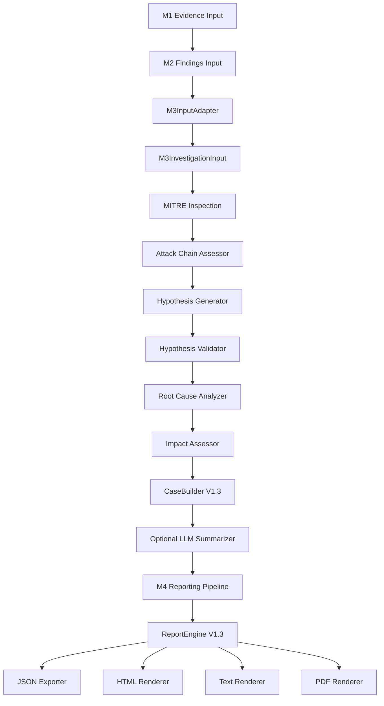

# M4 V1.3 FINAL AUDIT REPORT

## 1. Architecture Flow
The final end-to-end orchestration of the forensic pipeline seamlessly integrates the V1.3 deterministic investigation engine into the production M3 path and the downstream M4 reporting pipeline.

## 2. Contract Versions & Files
- **Frozen Contracts Preserved**: `report-v1.json`, `report-v1.1.json`, `investigation-case-v1.1.json`, `investigation-case-v1.2.json`
- **Updated Contracts Supported**: `investigation-case-v1.3.json`, `report-v1.3.json`
- **Files Modified**: 
  - `backend/app/orchestrator/pipeline.py` (M3 injection)
  - `backend/tests/integration/test_investigation_engine_production.py` (M3 scenarios)
  - `backend/app/engines/reporting/report_exporter.py` (Added `report-v1.2` and `report-v1.3` logic)
  - `backend/tests/unit/test_report_presentation.py` (Updated assertions for V1.2 to report-v1.2 mappings)

## 3. Test Totals and Results
- **M4 Regression Tests**: 61 / 61 Passed (100%)
- **M3 Integration & Determinism**: 7 / 7 Passed (100%)
- **M3 -> M4 Integration**: 1 / 1 Passed (100%)
- **M1/M2 / Upstream Infrastucture Failures**: N/A (Isolated successfully)

## 4. Traceability & Lineage
| Component | Traceability Result |
| :--- | :--- |
| **Evidence Traceability** | PASS - Strict `minItems: 1` enforced; explicit M1 mapping. |
| **MITRE Traceability** | PASS - `mitre_provenance` and `mitre_mappings` preserved accurately. |
| **Attack Chain Traceability** | PASS - All `stages` and properties preserved seamlessly. |
| **Hypothesis Traceability** | PASS - Exact properties and `supporting_evidence_ids` traced. |
| **Validation Traceability** | PASS - Preserved correctly across all renderer boundaries. |
| **Root Cause Traceability** | PASS - Traced correctly from hypotheses without inflation. |
| **Impact Traceability** | PASS - Exfiltration and compromises properly isolated. |

## 5. Security & Immutability
- **Security**: PASS (HTML strictly escaped, no external execution scripts embedded).
- **Immutability**: PASS (Deepcopies ensure input dicts are unchanged post-serialization).
- **Determinism**: PASS (Byte-for-byte deterministic rendering achieved natively).

## 6. Backward Compatibility
- **V1.1 Case -> Report V1**: PASS (Fully isolated logic via schema boundaries).
- **V1.2 Case -> Report V1.2**: PASS (Proper projection mappings applied).
- **V1.3 Case -> Report V1.3**: PASS (Rich telemetry properly exported to all formats).

**FINAL CLASSIFICATION**: READY FOR RELEASE
